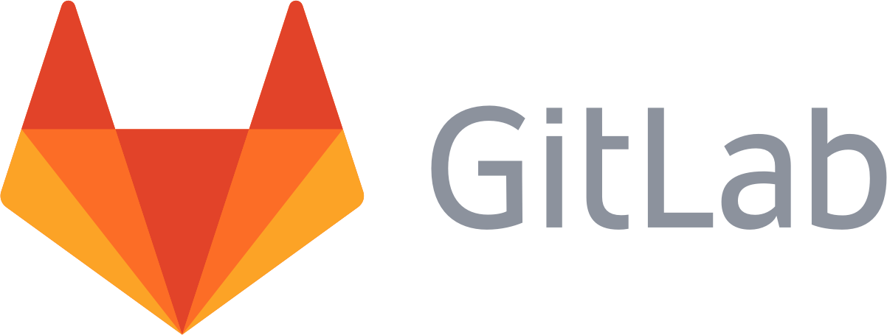

# Git

## What is Git ? 

Git is an open-source distributed version control system. They used to store and control changed any file type, 
whether a text file or binary file even source code.

## Why we use Git ?

1. Help for track history of source code whatever have been changed.
2. They can reversible track version of source code.
3. Easily to development software as a team. 

## Installation

Git can installed in Windows, MacOS and Linux

## Cloud

**Github**

Github is a development platform for sharing your source-code to worldwide whether team, classmates, co-workers, 
everyone can host, review code, manage project and build software. Support both of Open-Source and Business

[Link](https://github.com/)

**Gitlab**

Gitlab is a git repository management platform. You can host, review code, Issue tracking, activity feeds and wikis. 
Gitlab are very suitable for make DevOps Lifecycle because they have Build-in CI/CD in Free repository

[Link](https://gitlab.com/)

**Bitbucket**

Bitbucket is a git code management platform. Because Bitbucket are place for plan project, collaborate code they can test and deploy

[Link](https://bitbucket.org/dashboard/overview)

## Contributor

[Harin Thananam](https://github.com/Harin3Bone)